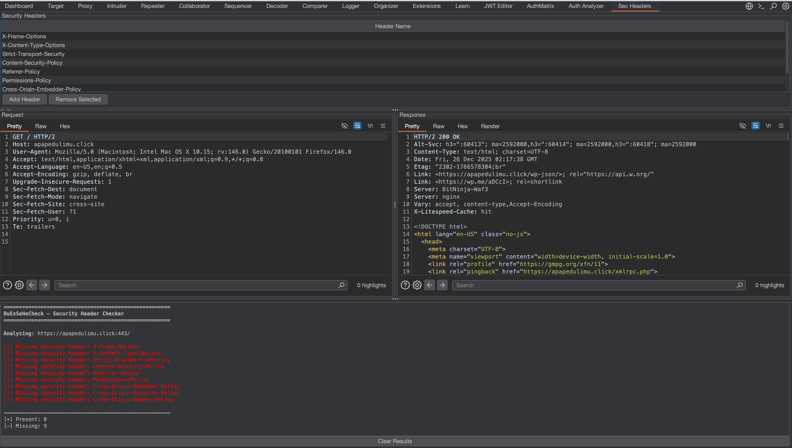

# 🔎 BuExSeHeCheck  
**Burp Extension – Security Header Checker**

BuExSeHeCheck is a Burp Suite extension for **interactive, pentester-driven analysis of HTTP security headers**, providing color-coded results with full request/response context.

It is designed to fit naturally into real-world penetration testing workflows, similar to Burp’s HTTP History and Repeater.

---

## ✨ Features

### 📤 Send from Burp Tools
- Right-click any request in:
  - Proxy → HTTP history
  - Repeater
- Select **“Send to BuExSeHeCheck”** to analyze the response

---

### 🧾 Request & Response Context
- Displays the **exact HTTP request and response** sent to the extension
- Read-only (non-editable), matching Burp’s native viewers
- Cleared automatically when results are cleared

---

### 🔍 Security Header Analysis
- Default headers checked:
  - X-Frame-Options
  - X-Content-Type-Options
  - Strict-Transport-Security
  - Content-Security-Policy
  - Referrer-Policy
  - Permissions-Policy
  - Cross-Origin-Embedder-Policy
  - Cross-Origin-Resource-Policy
  - Cross-Origin-Opener-Policy

- Header matching is **case-insensitive**
  - `X-Frame-Options`, `x-frame-options`, and `X-FRAME-OPTIONS` are treated equally

---

### 🛠 Adjustable Header List
- Add or remove security headers directly from the UI
- Header list updates are reflected immediately in analysis
- Useful for:
  - Custom hardening standards
  - Client-specific requirements
  - Emerging security headers

---

### ⚠️ Deprecated Header Detection (Toggleable)
- Optional detection of deprecated HTTP security headers:
  - `X-XSS-Protection`
  - `Public-Key-Pins`
  - `Expect-CT`
  - `Feature-Policy`

- Controlled via a checkbox:
  - ON → Deprecated headers are detected and reported
  - OFF → Deprecated headers are ignored

- **Auto-reload behavior**
  - Toggling the option immediately re-analyzes the last request
  - No need to resend the request

---

### 🟥🟩 Color-Coded Results
- 🟢 **Green** → Header present
- 🔴 **Red** → Header missing
- 🟠 **Orange** → Deprecated header detected
- Content-Security-Policy values are displayed in a readable, multi-line format

---

### 🧹 Clear Results
- Clears:
  - Analysis output
  - Request viewer
  - Response viewer
- Prevents stale data and accidental misinterpretation

---

### 🖥 Dedicated Burp Tab
- Appears as **“Sec Headers”** inside Burp Suite
- Adjustable layout:
  - Security header list
  - Request / response viewers
  - Analysis results

---

## 🖼 Screenshots

### 🔹 Main Interface

### 🔹 Send from HTTP History / Repeater

---

## 🔐 Why BuExSeHeCheck?

Security headers are often:
- Missing
- Inconsistently applied
- Misunderstood or deprecated

BuExSeHeCheck helps penetration testers and security engineers:
- Quickly validate security hardening
- Reduce manual inspection effort
- Avoid false positives caused by header case differences
- Detect legacy and deprecated defenses
- Maintain accuracy in professional security assessments

---

## 🧠 Design Philosophy
- Manual, analyst-driven execution
- No passive scanning
- No noisy automation
- Clear visibility and control

Built **by pentesters, for pentesters**.
